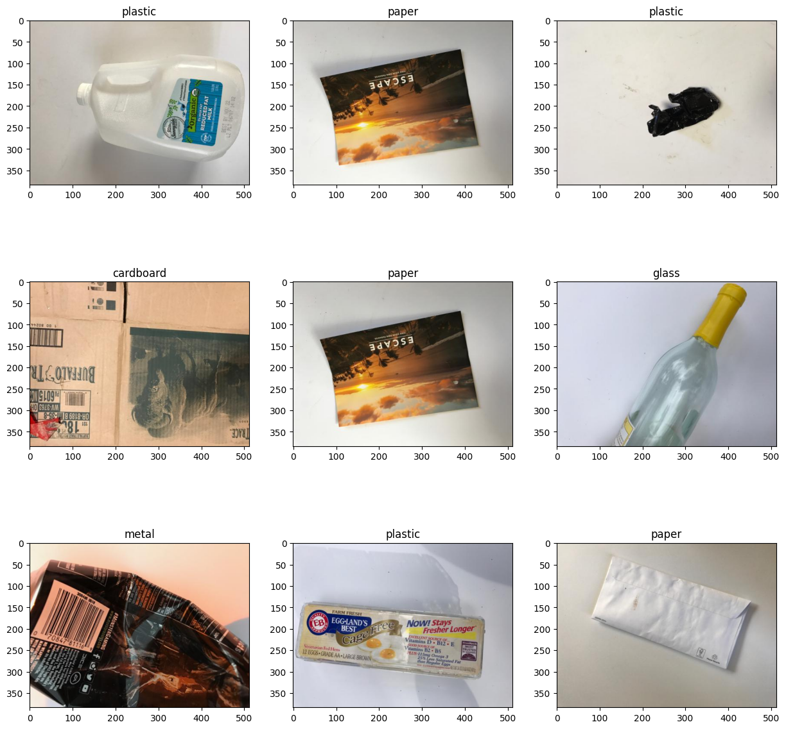
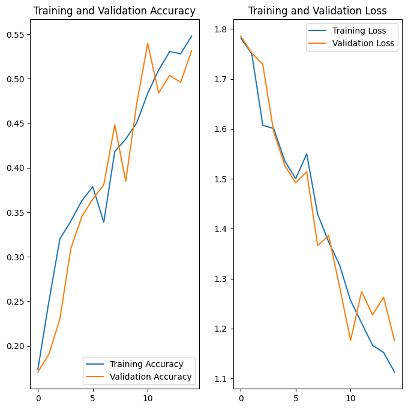
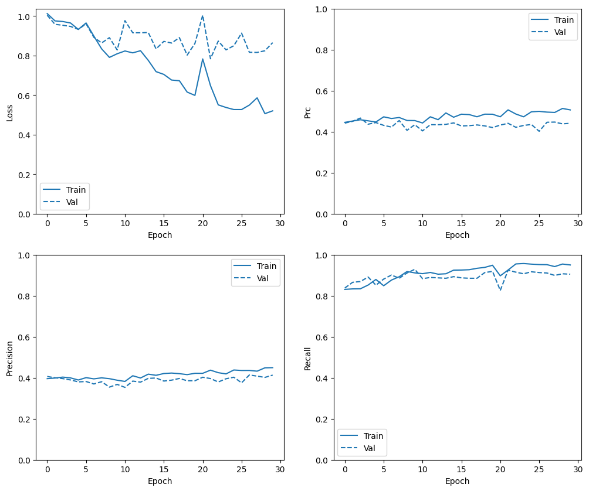

# Garbage Classification using CNN (TensorFlow)
This project builds a Convolutional Neural Network (CNN) to classify images of waste into six categories:  
**cardboard, glass, metal, paper, plastic, trash**

The goal is to demonstrate an end-to-end deep learning pipeline including:
- Data loading
- Exploratory Data Analysis (EDA)
- Model training
- Prediction pipeline
---

##  Dataset

- Source: Kaggle (provided by CCHANG, 2018)
- Task: Multi-class image classification of waste categories
- Challenge: Significant class imbalance (especially underrepresented "trash" class)
The dataset consists of labeled images across 6 categories:

- Cardboard
- Glass
- Metal
- Paper
- Plastic
- Trash

Each class contains real-world images with varying:
- Lighting conditions
- Backgrounds
- Object shapes

### Some instances

---

### Exploratory Data Analysis
Key insights:
- Slight class imbalance across categories
- High visual similarity between some classes (e.g., plastic vs glass)
- Variability in image quality and background

### Data Pipeline Development

A robust data pipeline was implemented using:

- Image normalization
- Data augmentation (rotation, flipping, etc.)
- Batch size experimentation for performance vs efficiency trade-off

### Handling Imbalanced Data

To address imbalance:

- Computed **class weights**
- Applied during training to penalize bias toward majority classes

This improved the model’s ability to learn minority class representations.
---
##  Model Development
### Baseline Model Development

- Initial CNN architecture built as a performance benchmark
- Provided a reference for further improvements
### Model Enhancement Through Experimentation

- Added deeper layers to improve feature extraction
- Tuned architecture to reduce overfitting
- Adjusted training strategies for better generalization

---
##  Hyperparameter Tuning
Used **Keras Tuner** to optimize:

- Number of layers
- Learning rate
- Optimizer choice

This systematic search improved both performance and training efficiency.
---

##  Model Interpretability

Implemented techniques to:

- Analyze prediction confidence
- Provide alternative class probabilities

This improves transparency and trust in model outputs.

---
##  Additional Experiments

- Attempted training on additional datasets to improve robustness
- Faced challenges due to:
  - Computational constraints
  - Increased pipeline complexity

---

##  Results

Establishes a baseline CNN model for garbage classification, with clear opportunities for improvement via transfer learning and tuning

### Accuracy & Loss 

### Loss, Precision, Recall & PRC

### Observations
- Training and validation accuracy increase steadily
- Validation follows training closely → limited overfitting
- Loss decreases consistently across epochs
- Model establishes a solid baseline for improvement
---

##  Limitations

- Class imbalance still impacts minority class performance
- Limited computational resources restricted large-scale experiments
- Model may require further tuning for real-world deployment

---

##  Future Work

- Explore advanced architectures (e.g., EfficientNet, ResNet)
- Improve data augmentation strategies
- Apply techniques like:
  - Focal Loss
  - Oversampling / SMOTE
- Optimize for edge deployment

---

##  Tech Stack

- Python
- TensorFlow / Keras
- Keras Tuner
- NumPy, Matplotlib

---

### Source of Data

The dataset used in this project was obtained from Kaggle, provided by CCHANG in 2018. You can find the dataset [here](https://www.kaggle.com/ds/81794).
